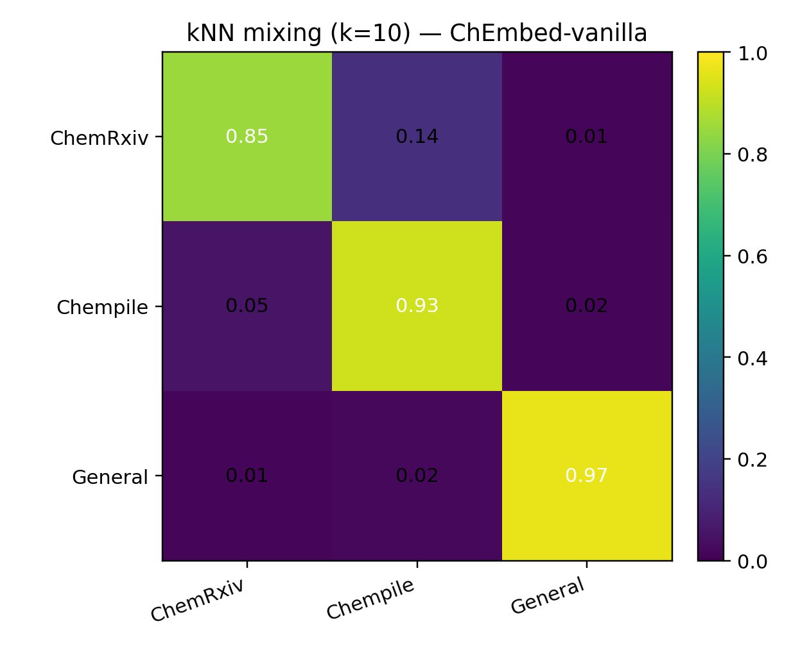
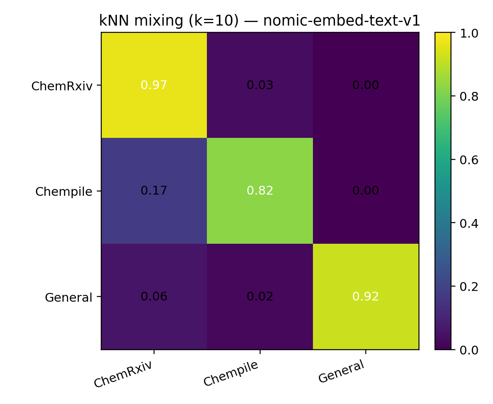
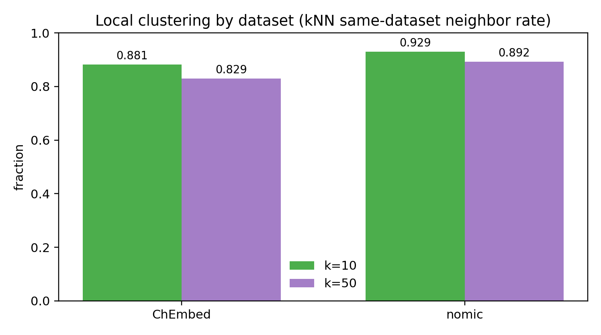
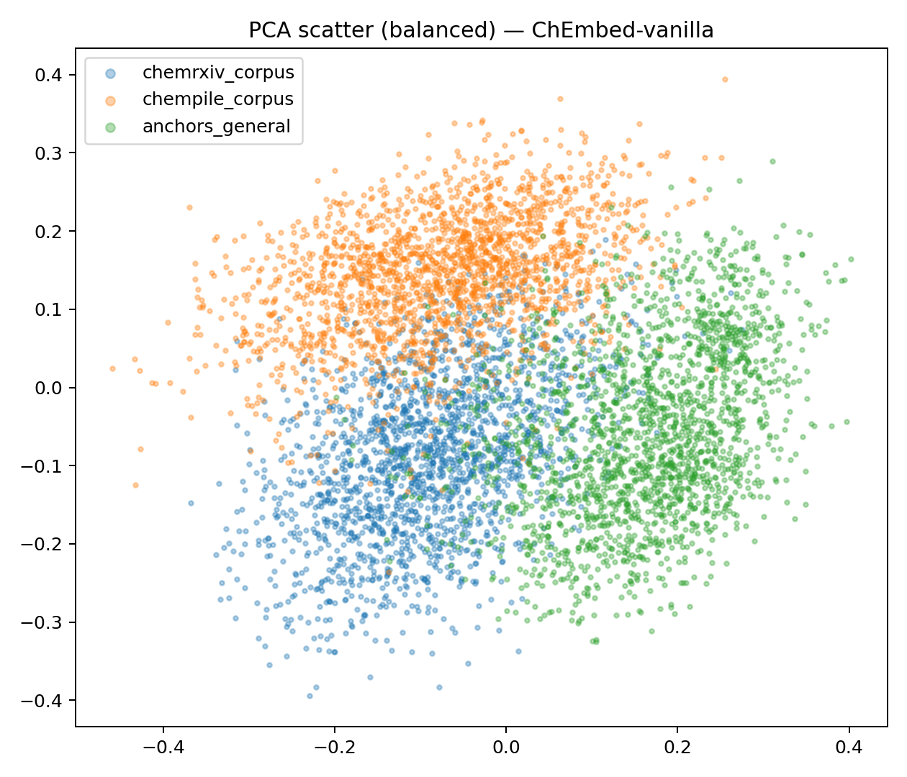
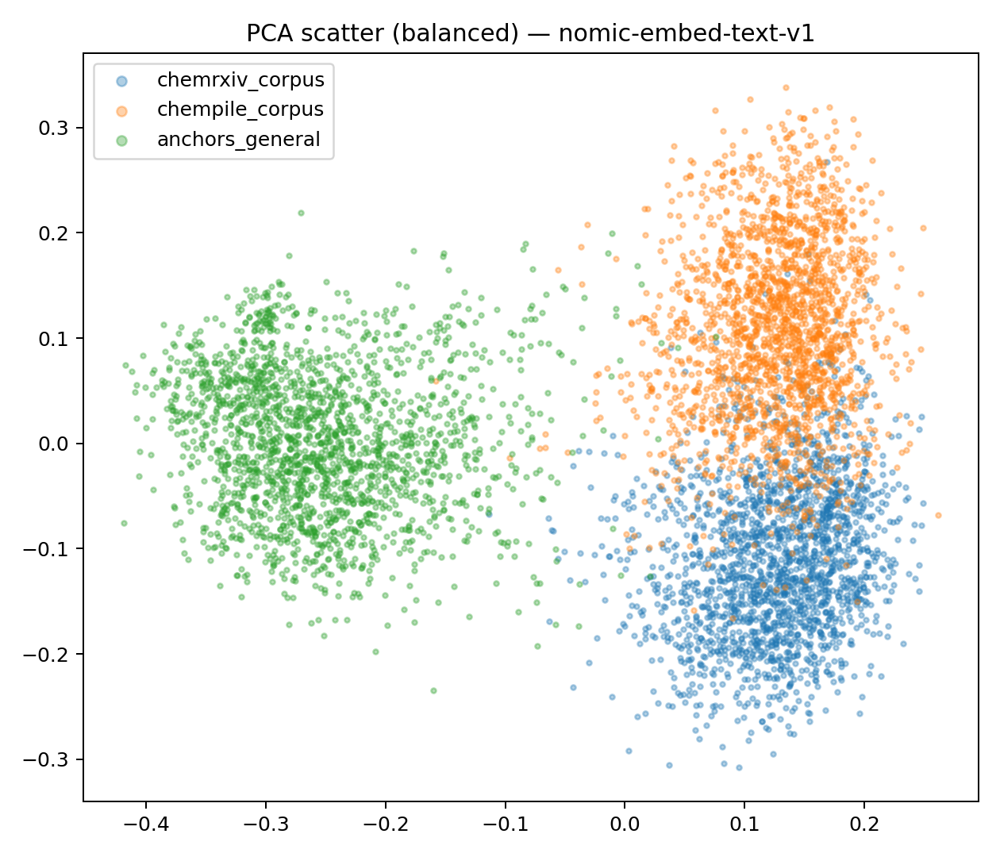

# Embedding geometry analysis — ChemRxiv vs Chempile vs General (Hotpot/NQ)

## 1) Goal / why we’re doing this
We need a clean, credible explanation for an uncomfortable empirical pattern in the ChEmbed story:

- ChEmbed is trained/adapted for **chemistry literature retrieval** (ChemRxiv paragraphs).
- On some **public general retrieval suites**, domain-adapted models can drop relative to a general-purpose baseline.

This analysis asks two concrete questions using a fixed set of precomputed embeddings for these corpora:

1) **Distribution shift:** Are ChemRxiv-literature passages, Chempile chemistry QA answers, and Wikipedia-style QA passages actually *different distributions* in embedding space?
2) **Representation change:** Does ChEmbed induce a meaningfully different geometry from the base model (nomic), i.e. does it change what counts as “nearby”?

If we can show strong, measurable shift + a clear geometry change, then “nomic wins on Chempile” can be explained as **task/style mismatch** rather than “our model is broken” or “we overfit to our own benchmark”.

## 2) Experimental setting
### Models
- **ChEmbed-vanilla**
- **nomic-embed-text-v1**

### Data (corpus-only for plots/shift metrics)
This run intentionally compares *passage-like items* only (no query mixing).

Chempile note: based on the anchor sample (`anchors_mixed_chem/texts.jsonl`), the “mixed chem” slice includes broader materials/matter + chemistry research text (not just a narrow chemistry-only subset).

- **ChemRxiv corpus:** 10,000 passages sampled from a larger pool (**~75,000** corpus passages).
- **Chempile corpus:** 3,185 answers (the embedded Chempile corpus size in this analysis; sourced from a Chempile retrieval split).
- **anchors_general corpus:** 2,000 passages (50/50 HotpotQA + Natural Questions).

### What’s included / excluded
- Included: **corpus embeddings** only for the above three sets.
- Excluded from plots: **queries** (especially because ChemRxiv queries are synthetic; we didn’t want query generation artifacts to dominate visuals).
- Note: raw texts for ChemRxiv/Chempile corpora are not currently included here (only anchors have `texts.jsonl`), which limits certain confound controls.

### Metrics (high signal)
We focus on three “shift” signals and a few “space comparison” signals.

## 2.1) Quick sanity check on a small Chempile retrieval slice (sampled)
Before interpreting global geometry, we ran a small retrieval sanity check on a sampled Chempile slice (50 queries × 200 candidates). This is not a full benchmark, but it gives a quick signal about (i) basic nearest-neighbor behavior and (ii) whether embeddings look “collapsed” or “spread out”.

**What the metrics mean**
- **HitRate@1:** fraction of queries where the top-1 retrieved item is correct (on this sampled slice). Higher is better.
- **Mean pairwise cosine (queries/docs):** average cosine similarity across all pairs within the query set (or doc set).
  - Higher values mean embeddings are more self-similar (“tighter / more collapsed”).
  - Lower values mean embeddings are more dispersed (“wider geometry / more diverse directions”).

**Results (sampled; see `results/embedding_diagnostics_A3_nomic_vs_vanilla_q50_c200.md`)**
- **nomic-embed-text-v1**
  - HitRate@1: **0.8800**
  - Mean pairwise cosine (queries): **0.4485**
  - Mean pairwise cosine (docs): **0.5644**

- **ChEmbed-vanilla**
  - HitRate@1: **0.8600**
  - Mean pairwise cosine (queries): **0.0750**
  - Mean pairwise cosine (docs): **0.1024**

Interpretation:
- On this small slice, nomic-embed-text-v1 slightly outperforms ChEmbed-vanilla on HitRate@1.
- This aligns with the later geometry results: ChEmbed-vanilla reorganizes the chemistry neighborhood structure much more aggressively than nomic-embed-text-v1, while remaining relatively aligned on general anchors.

**Shift (within each model):**
- **Centroid cosine distance:** compares the *mean embedding direction* (dataset centroid) between corpora. It’s a stable, global summary of how far two datasets drift in representation space.
- **kNN same-dataset neighbor rate (k=10,50):** measures local neighborhood mixing in a pooled corpus. High values mean most nearest neighbors come from the same dataset source → strong evidence of distribution shift.
- **Dataset-source linear probe (PCA→logreg, macro-F1):** trains a simple linear classifier to predict dataset source from embeddings (after PCA). High macro‑F1 means the dataset sources are easily distinguishable → the shift is not subtle.

**Space comparison (ChEmbed vs nomic on the same texts):**
- **Neighbor overlap (k=10,50):** measures agreement in nearest neighbors for the same points under two models. Near‑zero overlap indicates meaningfully different *local geometry*.
- **Pairwise distance correlation (Spearman, subsample):** compares distance *rankings* across models. Values near zero indicate the spaces are not related by a simple monotonic transform.
- **Linear CKA:** a representation similarity metric between embedding spaces. Informative but can be expensive because naive computation scales like O(N²).

## 3) Key findings (shift metrics + what they mean)
### A) ChEmbed shows large centroid separation between ChemRxiv and Chempile
**ChEmbed centroid cosine distances:**
- ChemRxiv vs Chempile: **0.414**
- ChemRxiv vs anchors_general: **0.571**
- Chempile vs anchors_general: **0.474**

Interpretation:
- In ChEmbed space, ChemRxiv paragraphs and Chempile QA answers are **far apart** in mean direction.
- Both are also far from Wikipedia-style anchors.
- This is consistent with strong specialization and strong dataset/domain structure.

### B) Nomic compresses the two chemistry sources (centroids are much closer)
**nomic centroid cosine distances:**
- ChemRxiv vs Chempile: **0.045**
- ChemRxiv vs anchors_general: **0.146**
- Chempile vs anchors_general: **0.148**

Interpretation:
- In nomic space, ChemRxiv and Chempile means are **very close** compared to ChEmbed.
- Both are also closer to the general anchors.
- This is consistent with nomic being more “domain-agnostic” (or less aggressively reshaping chemistry sub-domains).

### C) Despite PCA overlap, *both* spaces strongly cluster by dataset
kNN same-dataset neighbor rate (pooled corpora):

- **ChEmbed:** 0.881 (k=10), 0.829 (k=50)
- **nomic:** 0.929 (k=10), 0.892 (k=50)

Interpretation:
- Most points’ nearest neighbors come from the **same dataset source**, which is a strong locality-level shift signal.
- This says “the three corpora are distinct” even if a 2D projection looks messy.

Example visualization (how to read it): the kNN mixing heatmap shows, for each source dataset (row), what fraction of its top‑k neighbors come from each dataset (columns). A strong diagonal means “neighbors stay within the same dataset”; off‑diagonals show cross-dataset mixing.

ChEmbed-vanilla (k=10):

nomic-embed-text-v1 (k=10):

Summary across k:

### D) A simple linear probe can almost perfectly predict dataset source
Dataset-source probe (PCA→logreg, macro-F1):

- **ChEmbed:** 0.961
- **nomic:** 0.969

Interpretation:
- The corpora are **highly separable** in embedding space.
- This is strong evidence that “ChemRxiv vs Chempile vs Wikipedia” is a real distribution shift, not just noise.
- Terminology note: in standard ML terms, “a simple linear probe works well” means the dataset sources are close to **linearly separable** (after PCA) by a linear decision boundary.

## 4) Model comparison (ChEmbed vs nomic geometry)
On the *same texts*, ChEmbed-vanilla and nomic-embed-text-v1 produce extremely different neighborhood structure:

(Conceptually: we embed the same corpus with both models, then compare whether each point’s nearest neighbors are the same under both models.)

**ChemRxiv corpus:**
- neighbor overlap ≈ 0.001 (k=10), 0.0048 (k=50)
- Spearman distance correlation (subsample) ≈ 0.0017

**Chempile corpus:**
- neighbor overlap ≈ 0.0036 (k=10), 0.016 (k=50)
- Spearman distance correlation (subsample) ≈ -0.0094
- linear CKA ≈ 0.042

**General anchors corpus:**
- neighbor overlap ≈ 0.642 (k=10), 0.640 (k=50)
- Spearman distance correlation (subsample) ≈ 0.651
- linear CKA ≈ 0.867

Interactive PCA3 (centroids highlighted):
- `figs/pca3_plotly_ChEmbed-vanilla.html`
- `figs/pca3_plotly_nomic-embed-text-v1.html`

Interpretation:
- Chemistry corpora: near-zero agreement indicates ChEmbed-vanilla substantially changes local geometry relative to nomic-embed-text-v1 on ChemRxiv and Chempile-style text.
- General anchors: much higher agreement suggests the two models remain relatively aligned on general-domain text, which is consistent with “preserve general capability while specializing for chemistry literature”.

### Why the ChEmbed PCA plot can look more overlapped without implying “bad”
PCA(2D) is a projection onto the top-2 variance directions. Overlap in that view can happen even if:
- the clusters are separable in higher dimensions (the probe strongly suggests this)
- or the relevant separating directions are not the top-2 PCs

So: PCA overlap is not evidence of poor embedding quality by itself.

2D PCA scatter (intuition aid only; interpret alongside the kNN mixing heatmaps above):

ChEmbed-vanilla:

nomic-embed-text-v1:

## 5) Implications: why nomic can win on Chempile
The key point is **task/style mismatch** more than “chemistry topic”.

- ChemRxiv is literature paragraph retrieval: formal scientific prose, citations, long-range structure.
- Chempile is StackExchange-like QA: short conversational questions/answers, advice style, different lexical and discourse patterns.

A model adapted specifically for literature retrieval can legitimately:
- gain on ChemRxiv
- lose on QA-style retrieval, even if the topic is “chemistry” 

The centroid results suggest ChEmbed actively separates/reshapes ChemRxiv vs Chempile, while nomic keeps them closer. That is exactly what you’d expect if ChEmbed is specializing for one distribution.

## 6) What we still can’t conclude from geometry alone
- Geometry cannot by itself prove retrieval performance. These results explain *why* a Chempile drop could happen (shift + geometry change), but they do not replace task metrics.
- Confound controls (length/style): ChemRxiv paragraphs and Chempile answers differ in length and writing style. If we export raw texts (or at least token/char length stats), we can:
  - build a **length-only baseline** (can length predict dataset source?)
  - rerun probe + kNN mixing on **length-matched subsets**
  This helps separate “format/length shift” from “semantic/task shift”.

## 6.1) Task grounding: Chempile direct retrieval result (reported elsewhere in this repo)
This repo contains a direct retrieval benchmark on a Chempile split (see `results/results_summary.md`). For that task, nomic-embed-text-v1 outperforms ChEmbed-vanilla:

- **nomic-embed-text-v1**
  - NDCG@10: 0.7870
  - HitRate@10: 0.8961
  - MRR@10: 0.7522
  - HitRate@1: 0.6791

- **ChEmbed-vanilla**
  - NDCG@10: 0.7461
  - HitRate@10: 0.8584
  - MRR@10: 0.7100
  - HitRate@1: 0.6320

We include this as a small grounding point: it connects the geometric shift story to an actual retrieval outcome.

## 7) Visual artifacts (what we generated)
This report is intended to be standalone; the figures below are included as optional visual support for the quantitative claims.

- **kNN mixing heatmaps (recommended for communicating dataset mixing):**
  - `figs/knn_mixing_heatmap_ChEmbed-vanilla_k10.png`, `figs/knn_mixing_heatmap_ChEmbed-vanilla_k50.png`
  - `figs/knn_mixing_heatmap_nomic-embed-text-v1_k10.png`, `figs/knn_mixing_heatmap_nomic-embed-text-v1_k50.png`
  - JSON matrices (for exact values): `artifacts/knn_mixing_ChEmbed-vanilla.json`, `artifacts/knn_mixing_nomic-embed-text-v1.json`

- **2D PCA scatter (static):**
  - `figs/pca_scatter_ChEmbed-vanilla.png`
  - `figs/pca_scatter_nomic-embed-text-v1.png`

- **Interactive PCA3 (Plotly; includes centroids):**
  - `figs/pca3_plotly_ChEmbed-vanilla.html`
  - `figs/pca3_plotly_nomic-embed-text-v1.html`

- **Neighbor-mixing summary (static):**
  - `figs/knn_same_rate_bar.png`

## 8) Next actions (status)
1) **kNN mixing matrix + heatmap (k=10,50)**
   - Status: **DONE**
   - Files: `figs/knn_mixing_heatmap_<model>_k10.png`, `figs/knn_mixing_heatmap_<model>_k50.png`
   - JSON: `artifacts/knn_mixing_<model>.json`

2) **Centroid triangle + distance table figure**
   - Status: **NOT DONE** (not currently generated in `analysis/figs/`)

3) **Corpus text exports (or token/char length stats) for ChemRxiv + Chempile**
   - Status: **NOT DONE** (raw texts are not included here)

4) **Confound controls**
   - Length-only baseline: **NOT DONE** (requires texts/length stats across datasets)
   - Length-matched reruns: **NOT DONE** (requires texts/length stats)

## Artifacts currently present
- `artifacts/metrics.json` — machine-readable metrics
- `artifacts/knn_mixing_<model>.json` — kNN mixing matrices
- `figs/pca_scatter_<model>.png` — PCA (2D) scatter
- `figs/pca3_plotly_<model>.html` — interactive PCA (3D) with centroids
- `figs/knn_mixing_heatmap_<model>_k10.png`, `..._k50.png` — kNN mixing heatmaps
- `figs/knn_same_rate_bar.png` — kNN same-dataset rate summary
